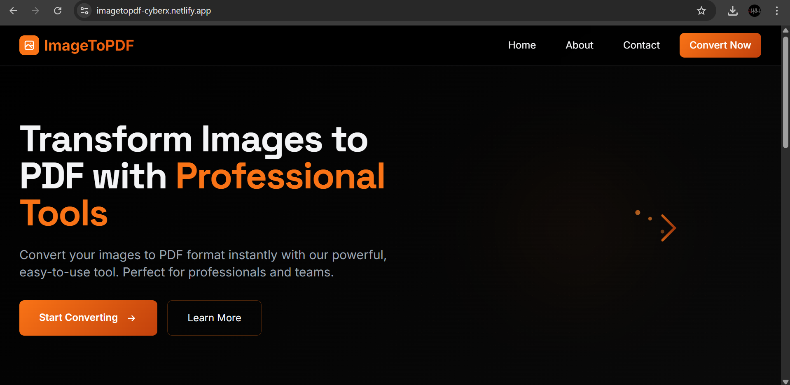

# ImageToPDF

ImageToPDF is a modern, browser-based web application that allows users to convert multiple images into a single PDF file. The entire conversion process happens on the client side, ensuring privacy, speed, and simplicity—no server or backend required.

## ✨ Features

- Convert multiple images into one PDF  
- Drag-and-drop image upload  
- Image preview with reordering support  
- Client-side processing (no uploads)  
- Supports JPG, PNG, and other common image formats  
- Fast, lightweight, and responsive UI  
- Works completely offline after loading  

## 🔒 Privacy & Security

Your files are **never uploaded or stored** anywhere.

- All images remain in your browser’s memory (RAM)  
- Conversion is done using client-side JavaScript  
- No backend, database, or cloud storage  
- Files are removed automatically when the page is refreshed or closed  

> Your data stays on your device at all times.

## 🛠️ Built With

- **HTML5**
- **Tailwind CSS**
- **JavaScript (ES6+)**
- **pdf-lib** – for PDF generation
- **Browser APIs** (File API, Blob, Canvas)

## 🚀 How It Works

1. Select or drag images into the app  
2. Images are loaded into browser memory  
3. Images are embedded into a PDF using `pdf-lib`  
4. A PDF file is generated and downloaded instantly  

No installations. No sign-ups. No data sharing.

## 📦 Usage

1. Open the website in your browser  
2. Upload or drag images  
3. Reorder images if needed  
4. Click **Convert to PDF**  
5. Download your PDF
## 📸 Screenshots

